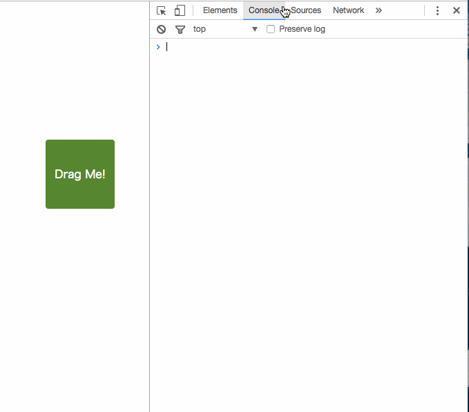

Elm DevTool (Proof of Concept)
----

The Elm 0.18 debugger works on popup window.
This project aims to figure out

* Possibility of making it work in Chrome's DevTools window
* How hard to migrate current debugger


## Screen capture




## How to try

1. Let Chrome read `package` directory as an extension.
2. `cd test` and `sh build.sh`, then `open index.html`.
3. Select `Elm` tab in DevTools.
4. Drag the object (This triggers rendering).

Maybe this works. Please tell me if it was wrong.


## How it works

The same script `app.js` works in both front-end and back-end.
Front-end program sends msg to back-end, and back-end program receives and processes it.

This requires some changes in elm-lang/virtual-dom package, but it is not a great deal.


## The difficulty

Content Security Policy.
Chrome Extension does not allow foreign script, so `app.js` cannot work without putting `unsafe-eval` into `content_security_policy` property in `manifest.json`.

```json
"content_security_policy": "script-src 'self' 'unsafe-eval'; object-src 'self'"
```


## How to solve

1. Make back-end script static (independent on application logic).
2. Don't use `update` function in back-end. So front-end should be "update as a service".
